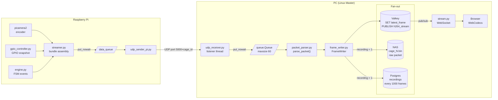

# UDP Data Flow

Every cage streams video and hardware state to the PC over UDP. This page explains exactly what gets bundled into each packet, how it travels, and where it ends up on the PC.



---

## Step 1 — Assembling the bundle on the Pi (`streamer.py`)

Once per encoded frame, `streamer.py` collects three things:

- **The current GPIO state** — which LEDs are on, which valves are open, which beams are broken right now. Read from `gpio_controller.get_current_state()`.
- **FSM events since the last frame** — any state transitions, beam breaks, or hardware changes that happened during this frame's time window. Drained from the engine's event buffer via `fsm_data_cb(current_timestamp)`.
- **A timestamp** — `CLOCK_MONOTONIC` in microseconds. This is also the cutoff for which events belong to this frame vs. the next.

All of this gets put into `data_queue` with `put_nowait`. If the queue is full (the sender can't keep up), the frame is dropped and a warning is logged — the camera never blocks.

---

## Step 2 — Sending the packet (`udp_sender_pi.py`)

A dedicated thread drains `data_queue` and sends one UDP packet per frame to the PC.

Each packet is a flat binary blob. The first 29 bytes are a fixed header:

| Offset | Size | What it is |
|---|---|---|
| 0 | 4 bytes | Frame counter — increases by 1 each frame, used to detect drops |
| 4 | 8 bytes | Timestamp in microseconds (`CLOCK_MONOTONIC`) |
| 12 | 4 bytes | Size of the video frame payload (bytes) |
| 16 | 4 bytes | Size of the events JSON blob (bytes) |
| 20 | 9 bytes | GPIO state: center LED, left LED, right LED, left valve, right valve, left beam, right beam, center beam, trial state |
| 29 | N bytes | Events as a JSON array |
| 29+N | M bytes | The H.264 video frame |

Each cage sends to port `5000 + cage_id` on the PC (cage 1 → 5001, cage 12 → 5012).

---

## Step 3 — Receiving on the PC (`udp_receiver.py`)

The PC runs one `UDPreceiver` per cage. It uses two threads to avoid blocking:

- A **listener thread** calls `recvfrom` in a tight loop and puts raw packets into an internal queue (max size 60). The socket has an 8 MB receive buffer so short bursts don't cause drops.
- A **worker thread** pulls packets from that queue and processes them one at a time.

If the queue fills up (the worker is too slow), packets are dropped. The `on_drop()` callback increments a counter so the watchdog can report it.

---

## Step 4 — Parsing the packet (`packet_parser.py`)

`parse_packet()` takes the raw bytes and returns a `ParsedFrame` object with all the fields unpacked — GPIO states, frame counter, timestamp, events list, and the raw bytes (kept for writing to the NAS). Returns `None` if the packet is malformed.

The frame counter is compared to the previous frame's counter. If the gap is more than 1, those frames were dropped on the network (`network_drop_count`). Gaps larger than 10000 are treated as a Pi restart rather than network loss.

---

## Step 5 — Writing the frame (`frame_writer.py`)

`frame_writer.py` decides what to do with each frame. It always writes to Valkey, and optionally writes to the NAS and database when recording is on.

**Always — Valkey:**

- If the frame is **MJPEG** (starts with `0xFF 0xD8`): writes it to `cage:{id}:latest_frame` with a 5-second TTL. The dashboard's camera snapshots come from here.
- If the frame is **H.264** (starts with `0x00 0x00 0x00 0x01`): publishes it to the `cage:{id}:h264_stream` Valkey channel. The browser's live stream comes from here via WebSocket.

**When recording is on — NAS:**

The full raw packet is appended to `<session_dir>/cage_{id}.bin` with a 4-byte length prefix in front of it. Nothing is decoded or re-encoded. The file on disk is exactly what came off the network.

**When recording is on — Postgres (every 1000 frames):**

One row is added to the `recordings` table with the frame range, timestamps, and byte offset into the `.bin` file. This index lets you seek to any point in the video without reading the whole file. The last partial chunk is flushed when recording stops.

---

## The live streaming path

```
Pi → UDP → udp_receiver.py → frame_writer.py → PUBLISH h264_stream → Valkey
                                                                          ↓
                                                        stream.py WebSocket handler
                                                                          ↓
                                                                      Browser
                                                               (WebCodecs decoder)
```

The WebSocket handler in `ui/endpoints/stream.py` subscribes to the `cage:{id}:h264_stream` Valkey channel. Each message has a 9-byte prefix (1 byte keyframe flag + 8 bytes timestamp). The handler strips that prefix and forwards the raw H.264 bytes to the browser, which decodes them using the WebCodecs API.
