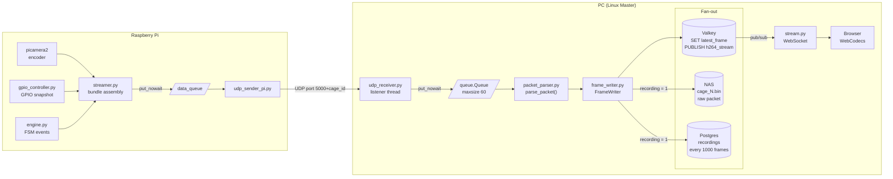

# UDP Data Flow

Every cage streams video and hardware state to the PC over a single UDP channel at camera frame rate. The path runs from the Pi camera encoder through a binary packet, across the network, and fans out to three destinations on the PC: Valkey (for live streaming), NAS (for recording), and Postgres (for indexing). This document traces that path end-to-end.



---

## 1. Bundle assembly on the Pi (`streamer.py`)

picamera2 calls `UDPFrameOutput.outputframe()` once per encoded H.264 frame. At that moment three things are captured:

- **GPIO snapshot** — `gpio_controller.get_current_state()` reads the current state of all outputs and sensors (LEDs, valves, beams).
- **FSM events** — `fsm_data_cb(current_timestamp)` drains all FSM state-transition and output events that occurred before the frame's capture time. This is why events in the UDP stream are time-aligned to frames rather than arriving independently.
- **Timestamp** — `CLOCK_MONOTONIC` in microseconds. The camera-relative PTS from picamera2 is converted to absolute `CLOCK_MONOTONIC` using an anchor computed on the first frame (`mono_at_start_us = mono_now - pts_at_first_frame`). This timestamp is also the cutoff passed to `pop_frame_events()`, so the same value governs both what gets stored in the packet header and which FSM events are bundled into this frame versus deferred to the next.

The bundle `{frame, gpio, timestamp, state, events}` is placed into `data_queue` with `put_nowait`. If the queue is full the frame is dropped with a warning; no blocking, no back-pressure to the encoder.

---

## 2. UDP transmission (`udp_sender_pi.py`)

`UDPSender` runs a dedicated consumer thread that drains `data_queue` and sends one UDP datagram per frame. Each packet is a flat binary blob:

| Offset | Size | Type | Field |
|---|---|---|---|
| 0 | 4 | uint32 LE | `frame_counter` — Pi's monotonically increasing sequence number |
| 4 | 8 | uint64 LE | `timestamp_us` — CLOCK_MONOTONIC capture time in µs |
| 12 | 4 | uint32 LE | `jpeg_size` — byte length of the frame payload |
| 16 | 4 | uint32 LE | `events_size` — byte length of the JSON events blob |
| 20 | 1 | uint8 | `led_center` |
| 21 | 1 | uint8 | `led_left` |
| 22 | 1 | uint8 | `led_right` |
| 23 | 1 | uint8 | `valve_left` |
| 24 | 1 | uint8 | `valve_right` |
| 25 | 1 | uint8 | `beam_left` |
| 26 | 1 | uint8 | `beam_right` |
| 27 | 1 | uint8 | `beam_center` |
| 28 | 1 | uint8 | `trial_state` |
| 29 | N | UTF-8 | Events JSON array |
| 29+N | M | bytes | H.264 Annex-B NAL unit(s) |

Total header size: 29 bytes. Packets exceeding the UDP limit of 65507 bytes are dropped with a warning log.

Each cage sends to the PC at `192.168.1.1` on port `UDP_BASE_PORT + cage_id` (cage 1 → 5001, cage 12 → 5012).

---

## 3. Reception on the PC (`udp_receiver.py`)

`UDPreceiver` uses a two-thread pipeline per cage to decouple network I/O from frame processing:

- **Listener thread** — calls `recvfrom(65535)` in a tight loop and places `(data, ip, port, arrival_time)` into an internal `queue.Queue(maxsize=60)`. The socket has an 8 MB kernel receive buffer (`SO_RCVBUF = 8388608`) to absorb bursts. If the queue is full, `put_nowait` raises `queue.Full`, the packet is discarded, and `on_drop()` increments the software drop counter.
- **Worker thread** — drains the queue and calls the frame callback for each datagram.

---

## 4. Packet parsing (`packet_parser.py`)

The frame callback calls `parse_packet(data, ip, arrival_time)`. This unpacks the 29-byte header using struct format `<IQIIBBBBBBBBB`, decodes the events JSON blob, and returns a `ParsedFrame` dataclass. Returns `None` on malformed input (wrong size, invalid JSON is silently swallowed and results in an empty events list).

`ParsedFrame` carries all header fields, the decoded events list, the full `raw_packet` bytes (used verbatim for NAS writes), and the `network_arrival_time` wall-clock float.

---

## 5. Network drop detection (`acquisition_main.py`)

The frame callback in `acquisition_main.py` tracks `last_frame_num` per cage. When `frame.pi_seq > last_frame_num + 1`, the gap is counted as `network_drop_count`. Gaps ≥ 10000 are assumed to be a Pi restart rather than network loss and are not counted.

---

## 6. Frame writing (`frame_writer.py`)

`FrameWriter.write_frame()` fans the frame out to up to three destinations. The recording flag is polled from Valkey at most once per `RECORDING_CHECK_INTERVAL_S = 1.0 s` to avoid a Valkey call on every frame.

### Always: Valkey

The frame bytes (everything after the header and events blob) are inspected by magic bytes:

- **MJPEG** (`0xFF 0xD8`): `SET cage:{id}:latest_frame = img_bytes` with a TTL of `VALKEY_FRAME_TTL_SECONDS = 5`. Used by the `/cage/{id}/frame` polling endpoint.
- **H.264 Annex-B** (`0x00 0x00 0x00 0x01`): `PUBLISH cage:{id}:h264_stream = meta + h264_bytes`, where `meta` is a 9-byte prefix: 1 byte keyframe flag (1 if the first NAL type is SPS = 7, else 0) followed by the 8-byte LE timestamp. The WebSocket handler subscribes to this channel and forwards the payload to the browser.

### When `cage:{id}:recording == "1"`: NAS

The full raw packet is written to `<session_dir>/cage_{id}.bin` with a 4-byte LE length prefix. Nothing is decoded or re-encoded — the binary on disk is identical to what came off the wire, so `bin_viewer.py` and any future tool can re-parse it independently.

### When recording: Postgres (batched)

Every `DB_CHUNK_SIZE = 1000` frames, one row is inserted into the `recordings` table:

| Column | Value |
|---|---|
| `cage_id` | cage index |
| `chunk_start_frame` | `pi_seq` of first frame in chunk |
| `chunk_end_frame` | `pi_seq` of last frame |
| `chunk_start_ts` | CLOCK_MONOTONIC µs of first frame |
| `chunk_end_ts` | CLOCK_MONOTONIC µs of last frame |
| `chunk_byte_offset` | byte offset into the `.bin` file where this chunk begins |
| `chunk_frame_count` | number of frames (≤ 1000) |

This index allows seeking into the `.bin` file by time or frame number without scanning the whole file. A final partial chunk is flushed on `FrameWriter.stop()`.

---

## 7. Live streaming path

```
Pi  →  UDP  →  UDPreceiver  →  FrameWriter  →  PUBLISH h264_stream  →  Valkey
                                                                            ↓
                                                          WebSocket handler (stream.py)
                                                                            ↓
                                                                        Browser
                                                                    (WebCodecs decode)
```

The WebSocket handler at `WS /cage/{id}/ws/video` subscribes to `cage:{id}:h264_stream` via Valkey pub/sub. For each message it strips the 9-byte metadata prefix and forwards the raw H.264 bytes to the browser, which decodes them using the WebCodecs API. The keyframe flag in the metadata prefix lets the browser know when a new keyframe group starts so it can initialise the decoder.
