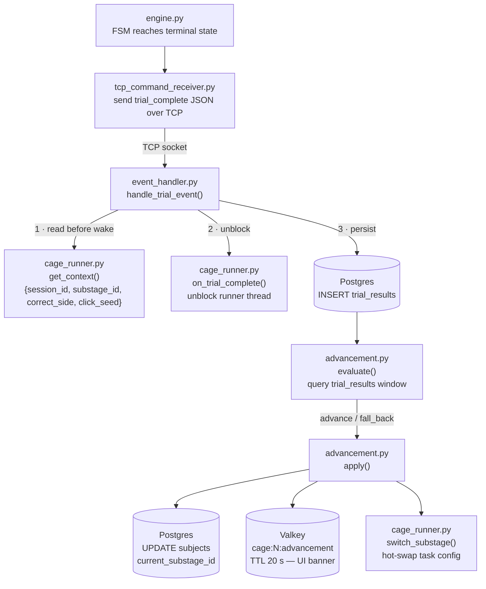

# Trial Events & Database Flow

When a trial finishes on the Pi, the result needs to make its way to the PC, get saved to the database, and potentially trigger a curriculum advancement. This page explains exactly how that happens, step by step.



---

## Step 1 — Trial ends on the Pi (`engine.py` + `tcp_command_receiver.py`)

When the FSM in `engine.py` reaches one of the terminal states (`__correct__`, `__wrong__`, or is stopped externally), it calls the `on_complete` callback. This leads to `tcp_command_receiver.py` sending a JSON message to the PC over the existing TCP connection:

```json
{
  "event": "trial_complete",
  "trial_id": "abc123",
  "outcome": "correct",
  "trial_start_us": 1234567890,
  "trial_start_real": 1717000000.123,
  "events": [
    { "t": 0.0,   "from": null,        "to": "cue_center" },
    { "t": 0.312, "output": "led_left", "active": true },
    { "t": 0.841, "sensor": "left",     "active": true },
    { "t": 0.841, "from": "cue_center", "to": "__correct__" }
  ]
}
```

`events` is the full list of everything that happened during the trial — every state transition, every GPIO change, every beam break — each with a time offset `t` in seconds from the start of the trial.

---

## Step 2 — PC receives the result (`tcp_command_sender.py` → `event_handler.py`)

The PC has a background thread in `tcp_command_sender.py` that continuously reads from the TCP socket. When it sees a trial event (anything that isn't an ACK), it calls `event_handler.handle_trial_event()`.

`event_handler.py` is where all the real work happens on the PC side.

---

## Step 3 — Read the runner context, then wake the runner

Before doing anything else, `event_handler` reads the runner's `context` dict from `cage_runner.py`:

```python
ctx = runner.get_context()  # {session_id, substage_id, correct_side, click_seed}
```

It reads this **first**, before calling `runner.on_trial_complete()`. The reason: `on_trial_complete()` wakes the runner thread, which immediately starts pre-computing the next trial and overwrites `correct_side`. If you read context after waking the runner, you might get the values for the *next* trial instead of the one that just finished.

After reading context, `runner.on_trial_complete()` is called to unblock the trial loop so it can start the ITI for the next trial.

---

## Step 4 — Save to the database (`trial_results`)

One row is inserted into the `trial_results` table in Postgres:

| Column | Where it comes from |
|---|---|
| `cage_id` | Which TCP connection the event arrived on |
| `trial_id` | From the Pi's JSON payload |
| `outcome` | `correct`, `wrong`, or `aborted` |
| `events` | The full events list as JSONB |
| `session_id` | From the runner context |
| `substage_id` | From the runner context |
| `correct_side` | From the runner context |
| `trial_start_us` | From the Pi's JSON — `CLOCK_MONOTONIC` in µs |
| `trial_start_real` | From the Pi's JSON — wall-clock anchor in seconds |
| `click_seed` | From the runner context — the RNG seed used for this trial's clicks |
| `completed_at` | `NOW()` on the PC — approximate wall time of receipt |

If there's no active session (e.g. a test run started manually from the UI), `session_id` and `substage_id` are NULL.

---

## Step 5 — Check for curriculum advancement (`advancement.py`)

After the INSERT, if `session_id` and `substage_id` are set, `advancement.evaluate()` runs. It:

1. Queries `trial_results` filtered to the current substage window — only trials since `substage_entered_at`.
2. Computes percent correct over a rolling window defined in the substage's `advance_criteria` or `fallback_criteria`.
3. Returns `"advance"`, `"fall_back"`, or `"stay"`.

If the decision is not `"stay"`, `advancement.apply()` runs:

- Updates `subjects.current_substage_id` and `subjects.substage_entered_at` in Postgres.
- Calls `runner.switch_substage()` to swap the task config in the live runner without stopping the session.
- Writes an advancement notification to Valkey key `cage:{id}:advancement` (TTL 20 seconds). The UI picks this up and shows a banner.
