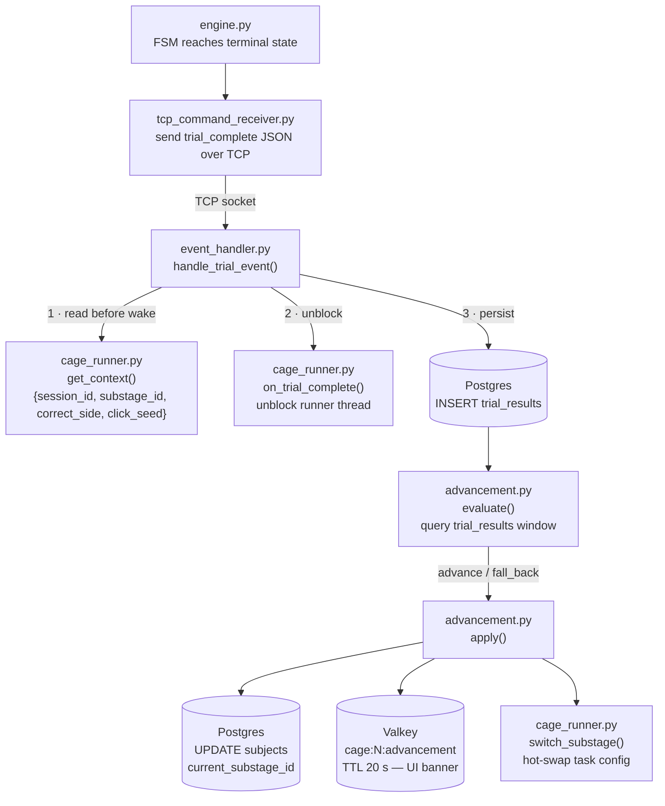

# Trial Events & Database Flow

This document covers how a completed trial result travels from the Pi to Postgres, and how that triggers automatic curriculum advancement.



---

## 1. Trial completion on the Pi (`tcp_command_receiver.py`)

When the FSM reaches a terminal state (`__correct__`, `__wrong__`, or is aborted), `Engine._finish_trial_from_fsm()` calls the `on_complete` callback. This sends a `trial_complete` or `trial_aborted` JSON event to the PC over the existing TCP connection:

```json
{
  "event": "trial_complete",
  "trial_id": "abc123",
  "outcome": "correct",
  "trial_start_us": 1234567890,
  "trial_start_real": 1717000000.123,
  "events": [
    { "t": 0.0,   "from": null,         "to": "cue_center" },
    { "t": 0.312, "output": "led_left",  "active": true },
    { "t": 0.841, "sensor": "left",      "active": true },
    { "t": 0.841, "from": "cue_center",  "to": "__correct__" }
  ]
}
```

`events` is the full `_trial_events` list from the engine — every state transition, hardware output change, and beam-break event that occurred during the trial, each with a trial-relative timestamp `t` in seconds.

---

## 2. Routing on the PC (`tcp_command_sender.py` → `event_handler.py`)

The `TCPCommandSender._read_loop` thread on the PC continuously reads from the TCP socket. Messages that are not ACK/ERROR are passed to the `on_event` callback, which is `event_handler.handle_trial_event`.

`handle_trial_event` also handles `sync_status` events (NTP reports from the Pi — written to Valkey with a 15-second TTL and not persisted to Postgres).

---

## 3. Reading runner context (`cage_runner.py`)

Before signalling the runner that the trial is done, `handle_trial_event` reads the runner's current `context` dict:

```python
ctx = runner.get_context()   # {session_id, substage_id, correct_side, click_seed}
runner.on_trial_complete(event)   # unblocks the trial-loop thread
```

The order matters: `on_trial_complete` wakes the runner thread, which immediately begins pre-computing the next trial and overwrites `correct_side`. Reading context first captures the values that belong to the trial that just finished.

---

## 4. Writing to Postgres (`trial_results`)

One row is inserted per trial:

| Column | Source |
|---|---|
| `cage_id` | TCP connection identity |
| `trial_id` | from the Pi's event payload |
| `outcome` | `correct` / `wrong` / `aborted` |
| `events` | full FSM event list (JSONB) |
| `session_id` | from runner context |
| `substage_id` | from runner context |
| `correct_side` | from runner context (`left` / `right` / NULL) |
| `trial_start_us` | CLOCK_MONOTONIC µs from Pi (FSM thread start time) |
| `trial_start_real` | CLOCK_REALTIME seconds from Pi (wall time anchor) |
| `click_seed` | RNG seed used to generate this trial's click train |
| `completed_at` | `NOW()` on the PC — approximate wall time of receipt |

`session_id` and `substage_id` are NULL for one-shot runs outside a session (e.g. dev/test runs via `POST /cage/{id}/trial/run`).

---

## 5. Advancement evaluation (`advancement.py`)

After the INSERT, if `session_id` and `substage_id` are set, `advancement.evaluate(subject_id, substage_id, conn)` runs:

1. Queries `trial_results` filtered to the current substage window (rows where the session's `substage_entered_at` is set).
2. Computes `pct_correct` over a rolling window defined in `advance_criteria` / `fallback_criteria` on the `training_substages` row.
3. Returns `"advance"`, `"fall_back"`, or `"stay"`.

If not `"stay"`, `advancement.apply()` updates `subjects.current_substage_id` and `subjects.substage_entered_at` in Postgres, then calls `runner.switch_substage()` to hot-swap the task config mid-session without stopping the runner. A notification is written to Valkey key `cage:{id}:advancement` (TTL 20 s) so the UI can display a banner.

---

## 6. Database schema summary

```
training_stages      — top-level curriculum groupings
training_substages   — one level per row; carries task_config JSONB + advancement rules
subjects             — animals; current_substage_id + substage_entered_at track progress
sessions             — one per sitting; links subject ↔ cage ↔ substage_id snapshot
trial_results        — one per trial; outcome, events JSONB, timing fields
recordings           — chunk index for .bin video files (written by frame_writer.py)
scoresheet_entries   — daily welfare checks; auto-created on session open
```

`task_config` in `training_substages` is the full trial JSON sent to the Pi — states, transitions, click rates, ITI parameters, etc. It is the single source of truth for what the Pi executes.
