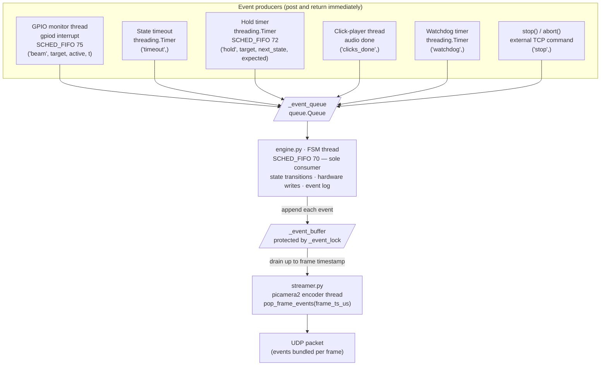

# Trial State Machine on the Pi

The `Engine` class in `engine.py` interprets a JSON trial definition and executes it on a dedicated FSM thread. All hardware control, state transitions, and event logging happen exclusively in that thread.

---

## Trial JSON structure

```json
{
  "trial_id": "example",
  "initial_state": "cue_center",
  "states": [
    {
      "id": "cue_center",
      "duration": 10.0,
      "entry_actions": [{ "type": "led_on", "target": "center" }],
      "exit_actions":  [{ "type": "led_off", "target": "center" }],
      "transitions": [
        { "trigger": "beam_break", "target": "center", "hold_ms": 50, "next_state": "reward" },
        { "trigger": "timeout",                                         "next_state": "iti" }
      ]
    }
  ]
}
```

`duration` arms a timeout timer when the state is entered. `entry_actions` and `exit_actions` are dispatched synchronously by the FSM thread. `transitions` are evaluated in order; the first match wins. `hold_ms` on a beam_break transition requires the beam to remain broken for that duration before the transition fires.

---

## Terminal states

Three reserved state IDs end the trial immediately when entered:

| State ID | Outcome |
|---|---|
| `__correct__` | `correct` |
| `__wrong__` | `wrong` |
| `__end__` | `correct` (used when the trial ends by design without a choice) |

`aborted` is produced by `stop()` (external STOP_TRIAL command) or by the watchdog firing.

---

## Event queue architecture

Every external source posts a tuple to `_event_queue` and returns immediately. The FSM thread is the sole consumer:

| Source | Event posted |
|---|---|
| GPIO monitor thread (gpiod interrupt) | `('beam', target, is_active, t)` |
| State timeout `threading.Timer` | `('timeout',)` |
| Hold timer `threading.Timer` | `('hold', target, next_state, expected_state)` |
| Click-player thread (audio done) | `('clicks_done',)` |
| Watchdog `threading.Timer` | `('watchdog',)` |
| `stop()` / `abort()` | `('stop',)` |



Because state transitions, hardware writes, and event logging all happen inside the FSM thread, no lock is needed on `_current_state_id` or transition logic. The only shared state requiring a lock is `_event_buffer` (written by the FSM thread, read by the picamera2 encoder thread via `pop_frame_events()`).

---

## Thread priorities

The FSM thread and its timing-critical collaborators all run on isolated CPU core 3 under `SCHED_FIFO`:

| Thread | Priority | Role |
|---|---|---|
| Click trigger | SCHED_FIFO 85 | Busy-wait click TTL timing |
| GPIO monitor | SCHED_FIFO 75 | Drains kernel beam-break events from gpiod |
| Hold timers | SCHED_FIFO 72 | One per beam; busy-wait for required hold duration |
| FSM | SCHED_FIFO 70 | Sole consumer of event queue |

Hold timers use a hybrid sleep: a coarse `time.sleep` for the bulk of the wait, then a busy-wait for the last 300 µs (`_HOLD_BUSY_TAIL_S`) for sub-millisecond accuracy. The FSM runs at SCHED_FIFO 70 so hold timers (72) can preempt it when a hold expires.

---

## Timestamp policy

All event timestamps are CLOCK_MONOTONIC seconds, trial-relative (offset from `_trial_start`):

- **Beam-break events** — stamped from the kernel GPIO interrupt timestamp (`ev.timestamp_ns / 1e9`), passed into `_on_beam_event()` by the GPIO monitor thread. Reflects the exact hardware interrupt time, not when Python ran the callback.
- **Hardware output events** — stamped in `_dispatch_action()` after `actions.dispatch()` returns, so `t` reflects when the GPIO pin actually changed.
- **State transitions** — stamped in `transition_to()` at decision time in the FSM thread.

`_trial_start` is captured inside the FSM thread after it has reached RT priority, so the first state's timeout deadline is measured from the same epoch as all other events.

---

## Event buffer and frame bundling

Every event appended to `_trial_events` (the full trial log) is also appended to `_event_buffer` (the rolling per-frame buffer). `pop_frame_events(frame_ts_us)` is called once per frame from the picamera2 encoder thread and returns all events with `t <= (frame_ts_us / 1e6) - trial_start`, holding the rest for the next frame. This is protected by `_event_lock`.

The returned events are bundled into the UDP packet for that frame, giving every frame a precise record of what happened during its capture window.

---

## Watchdog

A `threading.Timer` with a period of `TRIAL_WATCHDOG_S` (from `RPi_main/config.py`) is armed when the trial starts and restarted on every state transition. If it fires, the trial is aborted. This prevents a stuck state (e.g. a broken sensor or a missing `timeout` transition) from blocking the rig indefinitely.
