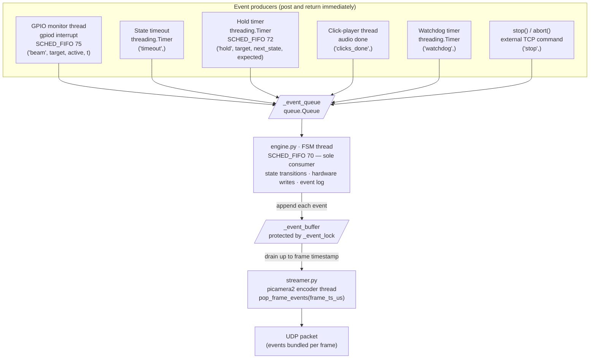

# Trial State Machine on the Pi

The trial logic on the Pi is a **state machine** — at any moment the trial is in exactly one state, and events cause it to move to the next state. The `Engine` class in `RPi_main/engine.py` implements this.

All hardware control, state transitions, and event logging happen in one dedicated FSM thread. Nothing else touches the trial state.

---

## What a trial looks like

A trial is defined as a JSON document sent from the PC. Here's a simple example:

```json
{
  "trial_id": "example",
  "initial_state": "cue_center",
  "states": [
    {
      "id": "cue_center",
      "duration": 10.0,
      "entry_actions": [{ "type": "led_on", "target": "center" }],
      "exit_actions":  [{ "type": "led_off", "target": "center" }],
      "transitions": [
        { "trigger": "beam_break", "target": "center", "hold_ms": 50, "next_state": "reward" },
        { "trigger": "timeout",                                         "next_state": "iti" }
      ]
    }
  ]
}
```

When the FSM enters a state:
1. It runs `entry_actions` (e.g. turn on an LED).
2. It arms a timeout timer if `duration` is set.
3. It waits for events.
4. When an event matches a transition, it runs `exit_actions` and moves to the next state.

`hold_ms` means the beam must stay broken continuously for that many milliseconds before the transition fires. This filters out accidental brief beam breaks.

---

## Terminal states

Three special state IDs end the trial immediately:

| State ID | Outcome recorded |
|---|---|
| `__correct__` | `correct` |
| `__wrong__` | `wrong` |
| `__end__` | `correct` (used when a trial finishes by design, not by animal choice) |

`aborted` happens when `stop()` is called externally (e.g. the PC sends a STOP_TRIAL command) or when the watchdog fires.

---

## The event queue

The FSM thread doesn't poll sensors directly. Instead, everything that can affect a trial puts a message into `_event_queue`, and the FSM thread reads from it one at a time. This is the key design choice — it means the FSM never needs locks on its own state.



Every event source puts a tuple into the queue and returns immediately — nobody waits. The FSM thread is the only one reading from the queue. Here's what each source sends:

| Source | What it puts in the queue | File |
|---|---|---|
| GPIO monitor thread | `('beam', target, is_active, timestamp)` | `gpio_handler.py` |
| State timeout timer | `('timeout',)` | `engine.py` |
| Hold timer | `('hold', target, next_state, expected_state)` | `engine.py` |
| Click-player thread | `('clicks_done',)` | `actions.py` |
| Watchdog timer | `('watchdog',)` | `engine.py` |
| External stop | `('stop',)` | `engine.py` |

---

## Thread priorities (why they matter)

The FSM and its helpers all run on CPU core 3 with `SCHED_FIFO` scheduling. The priority numbers decide who can interrupt whom:

| Thread | Priority | Why |
|---|---|---|
| Click trigger | 85 | Must fire clicks at exact times — can interrupt everyone else |
| GPIO monitor | 75 | Must read beam breaks fast — a slow read means an inaccurate timestamp |
| Hold timers | 72 | Must preempt the FSM when the hold duration expires |
| FSM | 70 | Processes events — can be preempted by the others |

Hold timers use a trick to hit sub-millisecond accuracy: they `sleep` for most of the wait, then busy-loop for the last 300 µs (`_HOLD_BUSY_TAIL_S` in the config). This is more accurate than sleeping the full duration.

---

## How events get into UDP packets

Every event logged by the FSM is also added to a separate buffer `_event_buffer`. Once per frame, the camera thread calls `pop_frame_events(frame_ts_us)`, which drains all events with a timestamp up to that frame's capture time. Those events are bundled into the UDP packet for that frame. This buffer is protected by `_event_lock` because it's shared between the FSM thread (writer) and the camera thread (reader).

The result: every video frame on the PC knows exactly what happened on the Pi during its capture window.

---

## The watchdog

A timer (`TRIAL_WATCHDOG_S` from `RPi_main/config.py`) is started when a trial begins and reset on every state transition. If the timer fires, the trial is aborted. This prevents a trial from getting stuck forever if a sensor breaks or a transition is missing from the trial definition.
