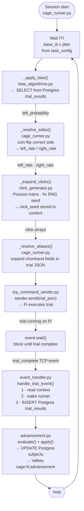

# Cage Runner

`CageRunner` in `ui/cage_runner.py` is the PC-side trial loop. There is one runner per cage, created at startup and kept alive permanently. The actual trial loop runs inside a worker thread that starts when a session opens and stops when a session closes.

---

## What the runner does

The runner's job is simple: prepare a trial, send it to the Pi, wait for the result, repeat. The clever part is that it prepares the *next* trial **during the ITI of the current trial** — so when the ITI ends, the trial is ready to send immediately with no extra delay.



---

## What happens inside the ITI

**`_apply_bias()` — `bias_algorithms.py`**

Queries recent rows from `trial_results` in Postgres and passes them to the registered bias-correction algorithm (set per-subject in the subjects table). The algorithm returns a `left_probability` between 0 and 1, or `None` to do nothing.

Three algorithms are available. See [Bias Algorithms](../reference/04_bias_algorithms.md) for details.

| Algorithm | Logic |
|---|---|
| `brody` | Push trials toward the side the animal finds harder |
| `ibl` | After a wrong trial, repeat on the animal's preferred side ("layup") |
| `rebalance` | Push toward whichever side has been presented less |
| `none` | Pure 50/50, no correction |

**`_resolve_sides()` — `cage_runner.py`**

Uses `left_probability` to coin-flip the correct side for this trial. Then assigns `left_rate` and `right_rate` from the substage's `task_config` to the correct and incorrect sides.

**`_expand_clicks()` — `click_generator.py`**

Generates two independent Poisson click trains (left channel and right channel). Uses a fixed random seed so the click pattern can be reproduced exactly later for analysis. The seed is stored in the runner's `context` dict and saved to `trial_results`. A minimum gap of 6 ms between clicks (start-to-start) prevents waveform overlaps in the Pi's audio output.

**`_resolve_aliases()` — `cage_runner.py`**

Expands any shorthand fields in the trial JSON. For example, `"click_rate": "high"` gets replaced with the actual number before the trial is sent.

---

## The context dict

At any point during a trial the runner holds a `context` dict:

```python
{
    "session_id":   int | None,
    "substage_id":  int | None,
    "correct_side": "left" | "right" | None,
    "click_seed":   int | None,
}
```

This is read by `event_handler.py` when a trial result arrives, **before** the runner is woken up. The reason: once the runner is woken, it immediately starts computing the next trial and overwrites `correct_side`. Reading first ensures the saved result belongs to the trial that just finished, not the next one.

---

## Waiting for the result

After sending the trial JSON, the runner calls `event.wait()` and blocks. It does not poll. It wakes up exactly once, when `on_trial_complete()` is called from `event_handler.py` on the TCP reader thread.

---

## Mid-session substage switch

`switch_substage(new_task_config, new_substage_id)` can be called from `event_handler.py` at any point between trials (while the runner is blocked in `event.wait()`). It swaps the task config and substage ID for the next iteration without stopping the session. If called while the runner is actively sending a trial, it returns `False` and the caller falls back to stopping and restarting the runner instead.
