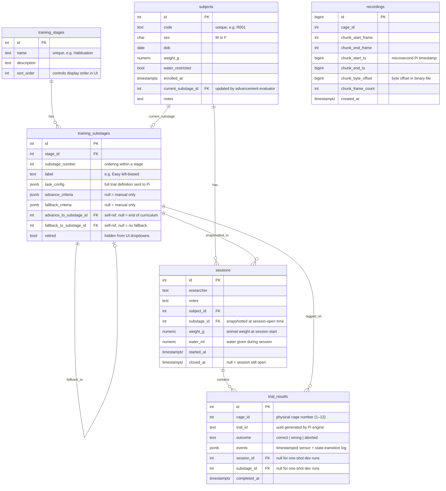
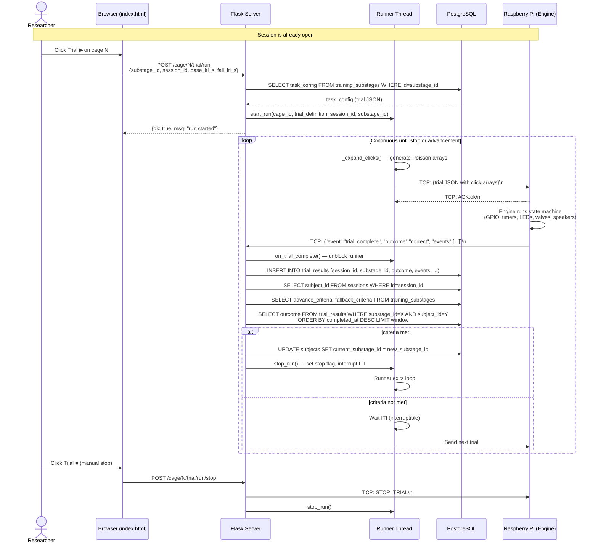

# BMI Closed-Loop — System Documentation

## Contents
1. [Database Schema (ER Diagram)](#1-database-schema)
2. [Trial Data Flow](#2-trial-data-flow)
3. [UI Backend — Endpoints](#3-ui-backend--endpoints)
4. [UI Backend — Core Modules](#4-ui-backend--core-modules)

---

## 1. Database Schema

Six tables. Foreign keys are shown with arrows. All IDs are SERIAL (auto-increment integers).



### Key design decisions

| Decision | Reason |
|---|---|
| `sessions.substage_id` is snapshotted at open time | Animal may advance mid-session; the session record stays accurate |
| `trial_results.substage_id` is stamped per-trial | Advancement evaluator queries `WHERE substage_id = X` — only counts trials on the current substage |
| `task_config` lives on `training_substages`, not a separate table | A substage IS a trial definition + curriculum metadata; no reason to split |
| `advance/fallback_criteria` are JSONB | Extensible — new criteria types can be added without schema changes |
| `recordings` tracks chunks, not whole files | Frame writer flushes every N frames; crash-safe, partial recordings are still useful |

### Criteria JSONB format

```json
{
  "type":      "pct_correct",
  "window":    20,
  "threshold": 0.80
}
```

- `type`: criteria function to apply. Currently only `pct_correct` is implemented.
- `window`: number of recent trials to evaluate (aborted trials excluded).
- `threshold`: fraction of correct outcomes required (0.0–1.0). In the UI this is shown as a percentage (0–100).

### `task_config` / trial definition format

This is the JSON sent to the Raspberry Pi engine:

```json
{
  "trial_id":     "trial_001",
  "initial_state": "cue_center",
  "states": [
    {
      "id":       "cue_center",
      "duration": 10.0,
      "entry_actions": [
        { "type": "led_on", "target": "center" },
        { "type": "play_clicks", "left_rate": 39, "right_rate": 9, "click_duration": 1.0 }
      ],
      "exit_actions": [
        { "type": "led_off", "target": "center" }
      ],
      "transitions": [
        { "trigger": "beam_break", "target": "center", "hold_ms": 50, "next_state": "reward" },
        { "trigger": "timeout",                                        "next_state": "__wrong__" }
      ]
    }
  ]
}
```

Terminal states: `__correct__`, `__wrong__` (end trial with outcome), `__end__` (ends as correct).

---

## 2. Trial Data Flow

From the researcher clicking **Trial ▶** to automatic advancement.



### Notes on the flow

- **Click expansion**: `left_rate`, `right_rate`, `click_duration` are stored in `task_config`. The runner calls `_expand_clicks()` before each rep to generate fresh Poisson arrays — different random pattern every trial.
- **ITI is interruptible**: The runner waits using `threading.Event.wait(timeout=iti)`. Both manual stop and advancement call `event.set()`, which wakes the runner immediately.
- **Advancement is synchronous with persistence**: The evaluator runs in the same DB connection as the result insert, so it always sees the just-written result.
- **One-shot runs** (via `POST /cage/N/trial/start` in `control.py`) bypass the runner entirely — no session, no advancement, no ITI. For development only.

---

## 3. UI Backend — Endpoints

All endpoints are Flask blueprints registered in `ui/ui_main.py`.

### `ui/endpoints/trial.py` — Trial execution and metrics

| Method | Path | Description |
|---|---|---|
| `GET` | `/metrics` | Per-cage aggregate stats from `trial_results`. Returns total, correct, wrong, aborted counts, success %, average response times. |
| `POST` | `/cage/<id>/trial/run` | Start a continuous run on a cage. Loads `task_config` from `training_substages`. Body: `substage_id`, `session_id`, `base_iti_s`, `fail_iti_s`. |
| `POST` | `/cage/<id>/trial/run/stop` | Stop the runner and send `STOP_TRIAL` to the Pi immediately. |

**Internal function `handle_trial_event(cage_id, event)`**

Called from `ui_main._on_pi_event()` when the TCP reader receives a `trial_complete` or `trial_aborted` event from the Pi. This is not an HTTP endpoint — it is the bridge between the TCP layer and the database/advancement system.

Sequence:
1. Calls `on_trial_complete()` to unblock the runner thread
2. Reads `session_id` and `substage_id` from `get_run_context()`
3. Inserts a row into `trial_results`
4. If `session_id` is set, looks up `subject_id` from `sessions`
5. Calls `advancement.evaluate()` and if non-stay, calls `advancement.apply()` then `stop_run()`

---

### `ui/endpoints/curriculum.py` — Curriculum definitions

| Method | Path | Description |
|---|---|---|
| `GET` | `/curriculum` | Serves the curriculum editor page (`curriculum.html`) |
| `GET` | `/training-stages` | List all stages with nested substages. Used by UI dropdowns everywhere. |
| `POST` | `/training-stages` | Create a new stage. Body: `name`, `description`, `sort_order`. |
| `GET` | `/training-substages/<id>` | Full detail for one substage including `task_config`, `advance_criteria`, `fallback_criteria`, advance/fallback target IDs. |
| `POST` | `/training-substages` | Create a new substage. Body: `stage_id`, `label`, `substage_number`, `task_config`, `advance_criteria`, `fallback_criteria`, `advance_to_substage_id`, `fallback_to_substage_id`. |
| `PATCH` | `/training-substages/<id>` | Update any fields on a substage. Accepts any subset of: `label`, `task_config`, `advance_criteria`, `fallback_criteria`, `advance_to_substage_id`, `fallback_to_substage_id`, `retired`. |

---

### `ui/endpoints/builder.py` — Trial definition editor

| Method | Path | Description |
|---|---|---|
| `GET` | `/builder` | Serves the legacy standalone builder page. Kept for reference. |
| `PATCH` | `/training-substages/<id>/task-config` | Save a trial definition into a substage's `task_config`. Body: `definition` (trial JSON). Called by the curriculum editor's "Save trial definition" button. |

---

### `ui/endpoints/subjects.py` — Animal management

| Method | Path | Description |
|---|---|---|
| `GET` | `/subjects-page` | Serves the subjects management page (`subjects.html`) |
| `GET` | `/subjects` | List all subjects with their current stage/substage labels. |
| `POST` | `/subjects` | Create a new subject. Body: `code`, `sex`, `dob`, `weight_g`, `water_restricted`, `current_substage_id`, `notes`. |
| `GET` | `/subjects/<id>` | Subject detail plus aggregate trial stats on their current substage. |
| `PATCH` | `/subjects/<id>/substage` | Manually override a subject's current substage. Body: `substage_id`. |

---

### `ui/endpoints/session.py` — Session management

| Method | Path | Description |
|---|---|---|
| `POST` | `/session/open` | Open a session. Body: `subject_id`, `researcher`, `weight_g`, `water_ml`, `notes`. Automatically snapshots `substage_id` from `subjects.current_substage_id`. |
| `POST` | `/session/<id>/close` | Close a session. Optionally updates `weight_g`, `water_ml` at close time. |
| `GET` | `/sessions` | List last 100 sessions with subject and substage info. |

---

### `ui/endpoints/control.py` — Hardware control + Graphviz

| Method | Path | Description |
|---|---|---|
| `POST` | `/cage/<id>/stream/start` | Send `START_STREAMING` to Pi. Sets Valkey flag. |
| `POST` | `/cage/<id>/stream/stop` | Send `STOP_STREAMING` to Pi. Clears Valkey flag. |
| `POST` | `/cage/<id>/trial/start` | **Dev only.** Send raw trial JSON directly to Pi, no runner, no session tracking. |
| `POST` | `/cage/<id>/trial/stop` | Send `STOP_TRIAL` directly to Pi. |
| `POST` | `/trial/graph` | Render a trial JSON definition as a Graphviz SVG. Used live by the curriculum editor as states are edited. Body: trial definition JSON. |

---

### `ui/endpoints/dev.py` — Development helpers

| Method | Path | Description |
|---|---|---|
| `POST` | `/dev/truncate/<table>` | Truncate a table (restricted to `trial_results`, `recordings`). Requires confirmation in UI. |

---

## 4. UI Backend — Core Modules

### `ui/runner.py` — Continuous trial runner

Manages one background thread per cage. The thread loops indefinitely, sending trials to the Pi and waiting for results.

**State dict** (keyed by `cage_id`):
```
{
  "thread":      threading.Thread,
  "event":       threading.Event,   # signalled by on_trial_complete() and stop_run()
  "last_result": dict | None,       # most recent Pi result event
  "stop":        bool,              # set by stop_run()
  "session_id":  int | None,
  "substage_id": int | None,
}
```

**Public API:**

| Function | Description |
|---|---|
| `start_run(cage_id, trial_definition, sender, base_iti_s, fail_iti_s, session_id, substage_id)` | Start a continuous run. Returns `(ok, msg)`. Fails if a run is already active on this cage. |
| `stop_run(cage_id)` | Signal the runner to stop. Sets `stop=True` and fires the event to interrupt any active ITI wait. |
| `on_trial_complete(cage_id, event)` | Called by `handle_trial_event` when the Pi result arrives. Stores result and fires the event to unblock the runner. |
| `get_run_context(cage_id)` | Returns `{session_id, substage_id}` for the active run. Used by `handle_trial_event` to stamp result rows. |
| `is_running(cage_id)` | Returns True if a runner thread is alive for this cage. |

**Loop behaviour:**
1. Check stop flag
2. Call `_expand_clicks()` — deep-copy trial, generate fresh Poisson arrays for any `play_clicks` action
3. Send trial JSON to Pi over TCP
4. `event.wait(timeout=330s)` — blocks until result or timeout
5. Compute ITI based on outcome (`base_iti_s` for correct, `fail_iti_s` for wrong/aborted)
6. `event.wait(timeout=iti)` — interruptible ITI; if woken, checks stop flag

---

### `ui/advancement.py` — Substage advancement evaluator

Pure functions, no Flask dependency. Called from `handle_trial_event` after each result is persisted.

**`evaluate(subject_id, substage_id, conn) → "advance" | "fallback" | "stay"`**

Loads `advance_criteria` and `fallback_criteria` from `training_substages`. Checks advance first, then fallback. Returns `"stay"` if criteria are null or not met.

**`apply(subject_id, substage_id, decision, conn) → new_substage_id | None`**

Reads the target substage ID from `advance_to_substage_id` or `fallback_to_substage_id`, then updates `subjects.current_substage_id`. Returns the new substage ID so the caller can log it.

**`_pct_correct(criteria, subject_id, substage_id, conn) → bool`**

Queries the last `window` non-aborted trials for this subject on this specific substage. Returns True if the correct fraction meets or exceeds `threshold`. Returns False if fewer than `window` trials exist (animal hasn't done enough trials yet).

> **Important**: the query filters by both `substage_id` AND `subject_id` (via session lookup). Trials from other substages or other animals are never counted. The window resets when the animal enters a new substage.

---

### `ui/click_generator.py` — Poisson click train generator

**`generate_clicks(left_rate, right_rate, duration, seed=None) → dict`**

Generates independent left and right Poisson click trains for one trial. Returns:
```python
{
  "left_clicks":  [0.023, 0.087, ...],  # seconds from trial start
  "right_clicks": [0.045, 0.112, ...]
}
```

- `seed=None` uses OS entropy — every call produces a unique pattern
- Inter-click intervals are exponentially distributed: `ICI ~ Exp(1/rate)`
- Difficulty is controlled by the ratio `left_rate / right_rate` (Brunton et al. 2013)

Click arrays are generated fresh per trial in `_expand_clicks()` inside the runner — the database stores only the compact rate parameters (`left_rate`, `right_rate`, `click_duration`), not the arrays.
